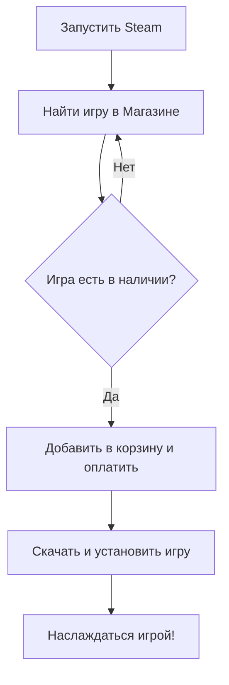
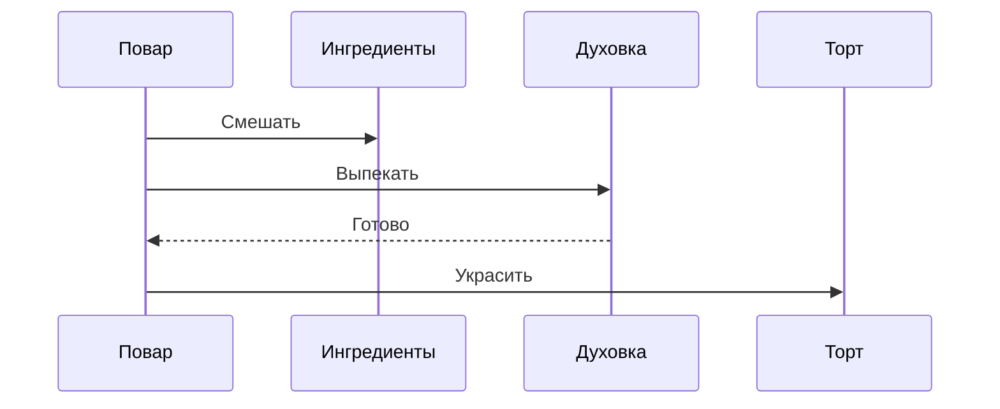
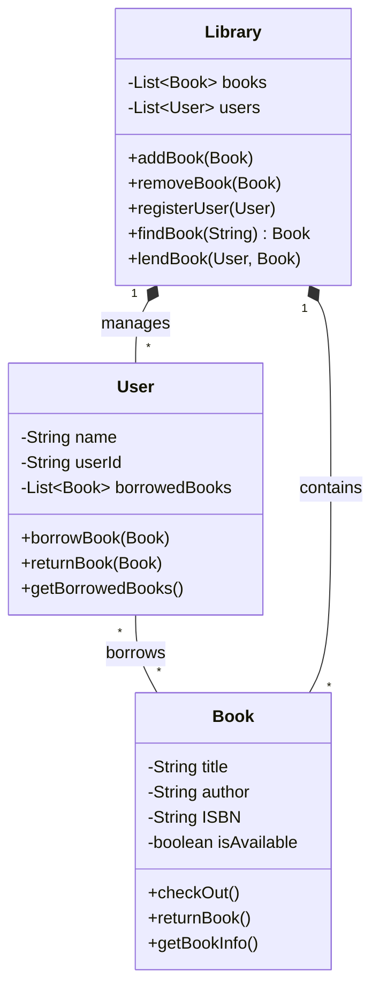
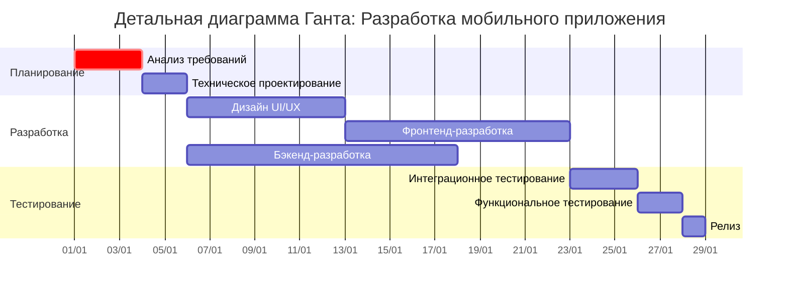
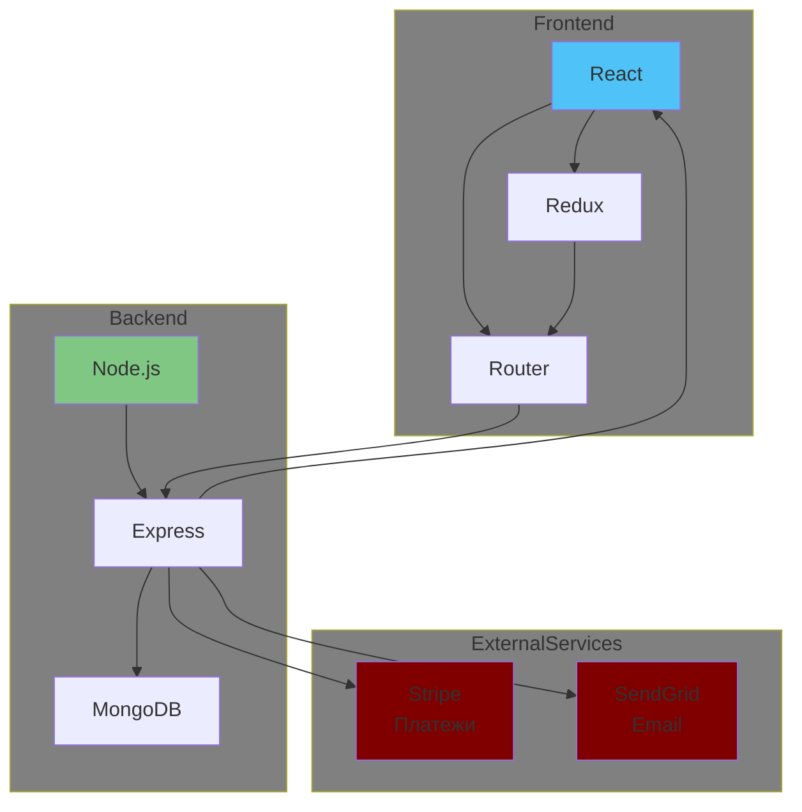
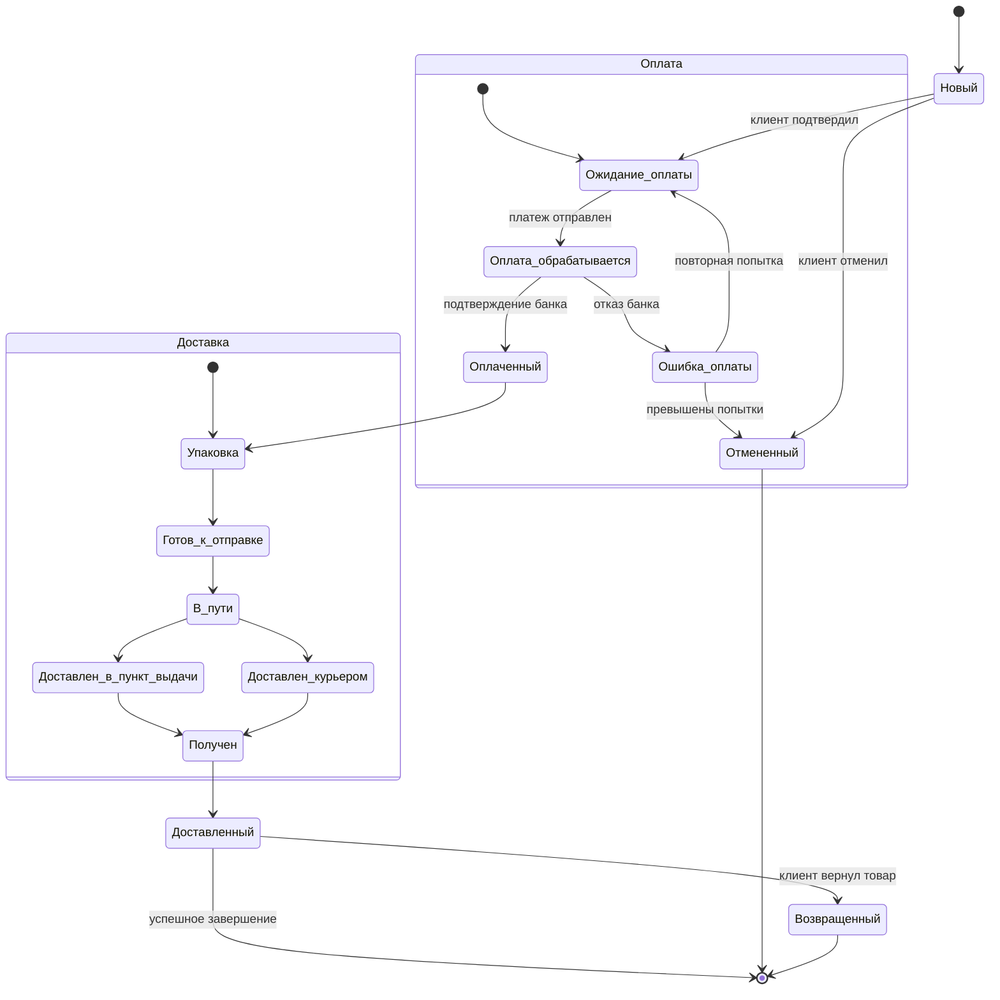

# vedear-mermaid
mermaid test

# Уровень 1
## Задание 1.1

```mermaid
    flowchart TD
    A[Запустить Steam] --> B[Найти игру в Магазине]
    B --> C{Игра есть в наличии?}
    C -- Да --> D[Добавить в корзину и оплатить]
    C -- Нет --> B
    D --> E[Скачать и установить игру]
    E --> F[Наслаждаться игрой!]
```

## Задание 1.2

```mermaid
sequenceDiagram
    Повар->>Ингредиенты: Смешать
    Повар->>Духовка: Выпекать
    Духовка-->>Повар: Готово
    Повар->>Торт: Украсить
```
# Уровень 2
## Задание 2.1

```mermaid
classDiagram
    class Book {
        -String title
        -String author
        -String ISBN
        -boolean isAvailable
        +checkOut()
        +returnBook()
        +getBookInfo()
    }

    class User {
        -String name
        -String userId
        -List~Book~ borrowedBooks
        +borrowBook(Book)
        +returnBook(Book)
        +getBorrowedBooks()
    }

    class Library {
        -List~Book~ books
        -List~User~ users
        +addBook(Book)
        +removeBook(Book)
        +registerUser(User)
        +findBook(String) Book
        +lendBook(User, Book)
    }

    User "*" -- "*" Book : borrows
    Library "1" *-- "*" Book : contains
    Library "1" *-- "*" User : manages
```

## Задание 2.2

```mermaid
gantt
    title Детальная диаграмма Ганта: Разработка мобильного приложения
    dateFormat  YYYY-MM-DD
    axisFormat  %d/%m

    section Планирование
    Анализ требований      :crit, req_analysis, 2024-01-01, 3d
    Техническое проектирование :tech_design, after req_analysis, 2d

    section Разработка
    Дизайн UI/UX          :design, after tech_design, 7d
    Фронтенд-разработка   :frontend, after design, 10d
    Бэкенд-разработка     :backend, after tech_design, 12d

    section Тестирование
    Интеграционное тестирование :integration_test, after frontend backend, 3d
    Функциональное тестирование :func_test, after integration_test, 2d
    Релиз                :release, after func_test, 1d
```
# Уровень 3
## Задание 3.1

```mermaid
graph TB
    subgraph Frontend
        A[React] --> B[Redux]
        A --> C[Router]
        B --> C
    end

    subgraph Backend
        D[Node.js] --> E[Express]
        E --> F[MongoDB]
    end

    subgraph ExternalServices
        G[Stripe<br/>Платежи]
        H[SendGrid<br/>Email]
    end

    %% Связи между компонентами
    C --> E
    E --> G
    E --> H
    E --> A

    %% Стилизация
    style Frontend fill:#808080
    style Backend fill:#808080
    style ExternalServices fill:#808080
    style A fill:#4fc3f7
    style D fill:#81c784
    style G fill:#800000
    style H fill:#800000
```

## Задание 3.2

```mermaid
stateDiagram-v2
    [*] --> Новый

    state "Оплата" as payment_process {
        [*] --> Ожидание_оплаты
        Ожидание_оплаты --> Оплата_обрабатывается : платеж отправлен
        Оплата_обрабатывается --> Оплаченный : подтверждение банка
        Оплата_обрабатывается --> Ошибка_оплаты : отказ банка
        Ошибка_оплаты --> Ожидание_оплаты : повторная попытка
        Ошибка_оплаты --> Отмененный : превышены попытки
    }

    state "Доставка" as delivery {
        [*] --> Упаковка
        Упаковка --> Готов_к_отправке
        Готов_к_отправке --> В_пути
        В_пути --> Доставлен_в_пункт_выдачи
        В_пути --> Доставлен_курьером
        Доставлен_в_пункт_выдачи --> Получен
        Доставлен_курьером --> Получен
    }

    Новый --> Ожидание_оплаты : клиент подтвердил
    Новый --> Отмененный : клиент отменил

    Оплаченный --> Упаковка
    Получен --> Доставленный
    Доставленный --> Возвращенный : клиент вернул товар
    Доставленный --> [*] : успешное завершение

    Отмененный --> [*]
    Возвращенный --> [*]
```
# Уровень 4
## Задание 4.1